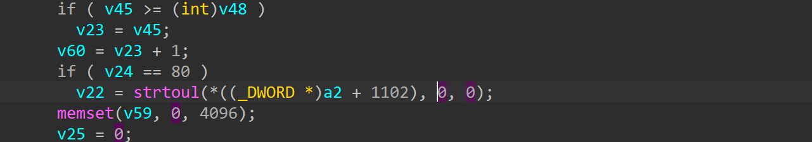
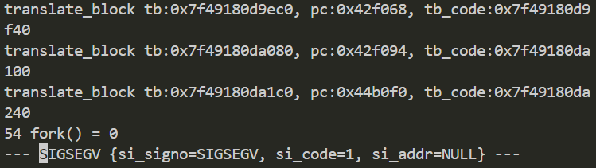

# xavn2001v2-0.4.0.7 DoS vulnerability
## firmware version
vendor: netgear

product: xavn2001v2

version: below or equal xavn2001v2-0.4.0.7

## description
In netgear xavn2001v2-0.4.0.7, binary `/usr/sbin/uhttpd` contains a DoS vulnerability. Attackers can send malicious packet to trigger the vulnerability.

## detail
In function `cgi_request` (address: 0x44b0f0), strtoul's parameter isn't checked before computed, causing NULL pointer dereference ans DOS.

## send packet
You can send the POC packet via TCP to the `80` port of the firmware's web server to trigger the vulnerability.

## poc
see [poc](./poc)

## screenshot
The qemu logging shows that the web server encounters a crash and SEGSEGV signal has triggered, and web server has stoppod working.

