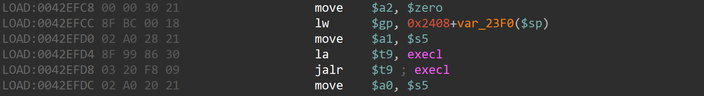

# xavn2001v2-0.4.0.7 command injection vulnerability
## firmware version
vendor: netgear

product: xavn2001v2

version: below or equal xavn2001v2-0.4.0.7

support url: https://www.netgear.com/support/product/xavn2001v2/#download

firmware download url: https://www.downloads.netgear.com/files/GDC/XAVN2001/XAVN2001-V0.4.0.7.zip

## description
In netgear xavn2001v2-0.4.0.7, binary `/usr/sbin/uhttpd` contains a command injection vulnerability. Attackers can send malicious packet to trigger the vulnerability and execute arbitary code.

## detail
In function `cgi_request` (address: 0x42E91C), the following loop doesn't check the parameter of `execl`, causing command injection vulnarability

## send packet
You can send the POC packet via TCP to the `80` port of the firmware's web server to trigger the vulnerability.

## poc
see [poc](./poc)

## screenshot
The qemu logging shows that the web server encounters a command injection and the parameter is under attacker's control. By using path traversal we can execute arbitary command on the router.

## timeline
[24/10/11] report to vendor and CVE
