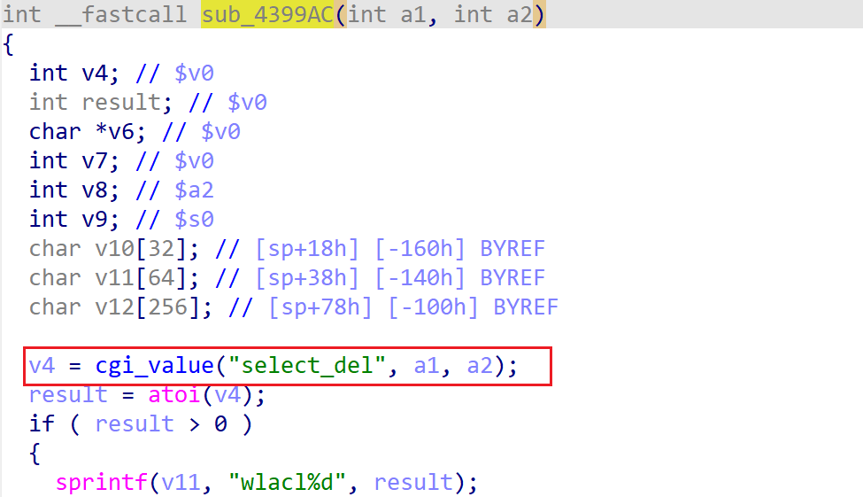

# xavn2001v2-0.4.0.7 DoS vulnerability
## firmware version
vendor: netgear

product: xavn2001v2

version: below or equal xavn2001v2-0.4.0.7

## description
In netgear xavn2001v2-0.4.0.7, binary `/usr/sbin/uhttpd` contains a  DoS vulnerability. Attackers can send malicious packet to trigger the vulnerability. The vulnerability lies in `atoi` in function `sub_4399AC`.

## detail
In function `sub_4399AC` (address: 0x4399AC), the following code parses user's input containing `select_del` into local variable `v4`.

However, it didn't check whether the variable is NULL or not before use and dereference it in `atoi`, causing potential NULL pointer dereference.

## Impact
The vulnerability can cause Denial Of Service of the device.

## poc
see [poc](./poc)

see [backtrace](./backtrace) for more information.
