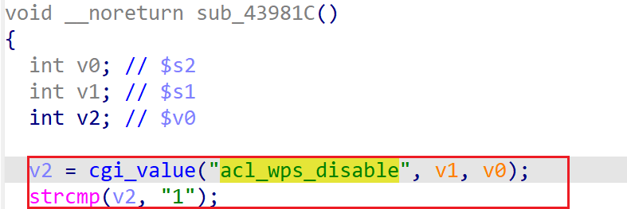

# xavn2001v2-0.4.0.7 DoS vulnerability
## firmware version
vendor: netgear

product: xavn2001v2

version: below or equal xavn2001v2-0.4.0.7

support url: https://www.netgear.com/support/product/xavn2001v2/#download

firmware download url: https://www.downloads.netgear.com/files/GDC/XAVN2001/XAVN2001-V0.4.0.7.zip

## description
In netgear xavn2001v2-0.4.0.7, binary `/usr/sbin/uhttpd` contains a  DoS vulnerability. Attackers can send malicious packet to trigger the vulnerability. The vulnerability lies in `strcmp` in function `sub_43981C`.

## detail
In function `sub_43981C` (address: 0x43981C), the following code parses user's input containing `acl_wps_disable` into local variable `v2`.

However, it didn't check whether the variable is NULL or not before use and dereference it in `atoi`, causing potential NULL pointer dereference.

## Impact
The vulnerability can cause Denial Of Service of the device.

## poc
see [poc](./poc)

see [backtrace](./backtrace) for more information.
