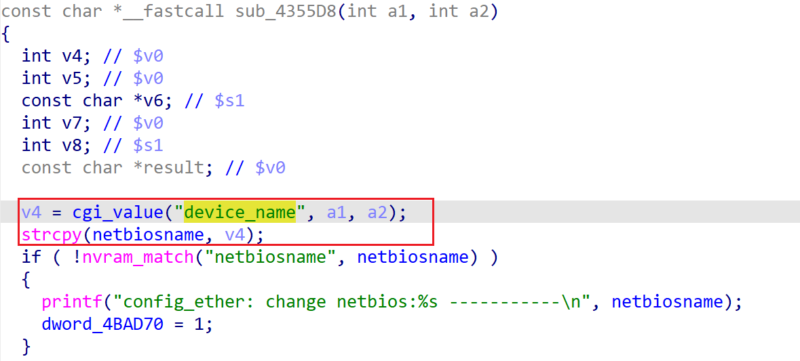

# xavn2001v2-0.4.0.7 global buffer overflow vulnerability
## firmware version
vendor: netgear

product: xavn2001v2

version: below or equal xavn2001v2-0.4.0.7

## description
In netgear xavn2001v2-0.4.0.7, binary `/usr/sbin/uhttpd` contains a global buffer overflow vulnerability. Attackers can send malicious packet to trigger the vulnerability. The vulnerability lies in function `sub_4355D8` when parsing input containing `device_name`.

## detail
In function `sub_4355D8` (address: 0x4355D8), the following code parses user's input containing `device_name` into local variable `v4`.

Then it uses strcpy to cpoy the input from user into a global buffer without checking its length, causing potential global buffer overflow.

## Impact
The vulnerability can cause Denial Of Service of the device or arbitary code execution.

## poc
see [poc](./poc)

see [backtrace](./backtrace) for more information.
