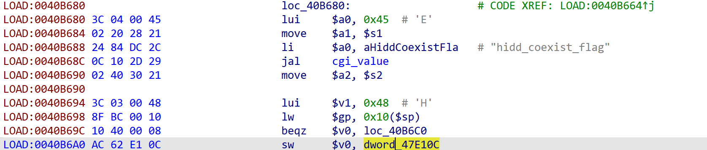
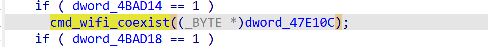
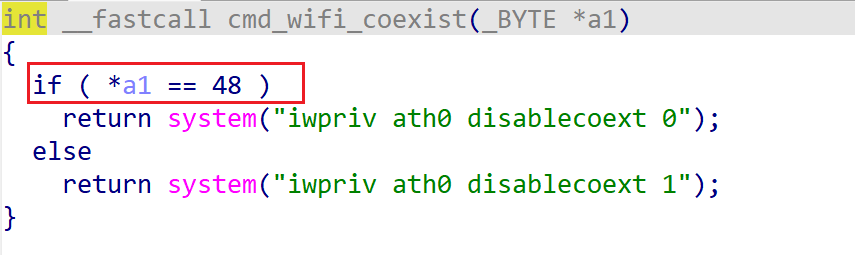

# xavn2001v2-0.4.0.7 DoS vulnerability
## firmware version
vendor: netgear

product: xavn2001v2

version: below or equal xavn2001v2-0.4.0.7

## description
In netgear xavn2001v2-0.4.0.7, binary `/usr/sbin/uhttpd` contains a  DoS vulnerability. Attackers can send malicious packet to trigger the vulnerability. The vulnerability lies in NULL pointer dereference in function `cmd_wifi_coexist`.

## detail
In (address: 0x40B680), the following code parses user's input containing `hidd_coexist_flag` into global variable `dword_47E10C`.

The global variable `dword_47E10C` is then used in `cgi_commit` as a parameter of function `cmd_wifi_coexist`.

However, in function `cmd_wifi_coexist`, it didn't check whether the variable is NULL or not before use and dereference it, causing potential NULL pointer dereference.

## Impact
The vulnerability can cause Denial Of Service of the device.

## poc
see [poc](./poc)

see [backtrace](./backtrace) for more information.
