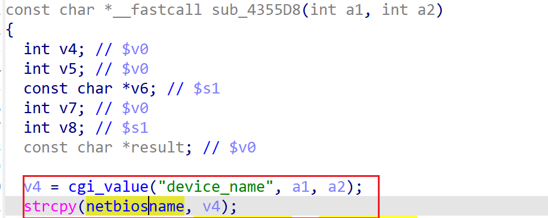

# xwn5001-0.4.1.1 stack-based buffer overflow vulnerability
## firmware version
vendor: netgear

product: xwn5001

version: below or equal xwn5001-0.4.1.1

## description
In netgear xwn5001-0.4.1.1, binary `/usr/sbin/uhttpd` contains a global variable buffer overflow vulnerability. Attackers can send malicious packet to trigger the vulnerability. The vulnerability lies in parameter `device_name` in function `sub_4355D8`.

## Impact
The vulnerability can cause Denial Of Service of the device, or even arbitary code execution.

## detail
In function `sub_4355D8` (address: 0x4355D8), the following code concats user's input into global variable `netbiosname`, which is a global variable with limited size.

However, it didn't check the length of input from user, Causing potential global variable buffer overflow. 

