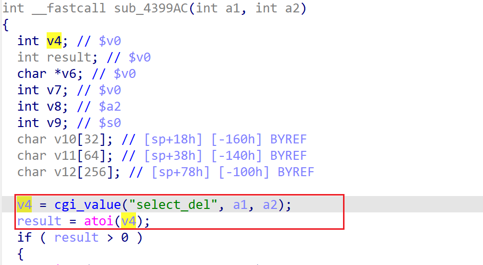

# xwn5001-0.4.1.1 DoS vulnerability
## firmware version
vendor: netgear

product: xwn5001

version: below or equal xwn5001-0.4.1.1

## description
In netgear xwn5001-0.4.1.1, binary `/usr/sbin/uhttpd` contains a DoS vulnerability. Attackers can send malicious packet to trigger the vulnerability. The vulnerability lies in parsing and using paramater `select_del` in function `sub_4399AC`.

## Impact
The vulnerability can cause Denial Of Service of the device.

## detail
In function `sub_4399AC` (address: 0x4399AC), the following code concats user's input containing `select_del` into local variable `v4`.

However, it didn't check whether `v4` is NULL or not before use and dereference it in `atoi`, causing potential NULL pointer dereference.

## poc
see [poc](./poc)

see [backtrace](./backtrce) for more information.
