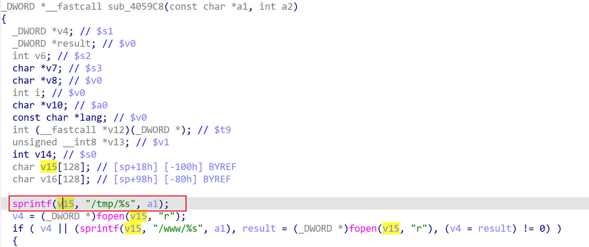

# xwn5001-0.4.1.1 stack-based buffer overflow vulnerability
## firmware version
vendor: netgear

product: xwn5001

version: below or equal xwn5001-0.4.1.1

## description
In netgear xwn5001-0.4.1.1, binary `/usr/sbin/uhttpd` contains a stack-based buffer overflow vulnerability. Attackers can send malicious packet to trigger the vulnerability. The vulnerability lies in function `sub_4059C8`.

## Impact
The vulnerability can cause Denial Of Service of the device, or even arbitary code execution.

## detail
In function `sub_4059C8` (address: 0x4059C8), the following code concats user's input into local variable `v15`, which is a stack-based variable with limited size.

However, it didn't check the length of input from user, Causing potential stack-based buffer overflow. 

## poc
see [poc](./poc)

see [backtrace](./backtrace) for more information.